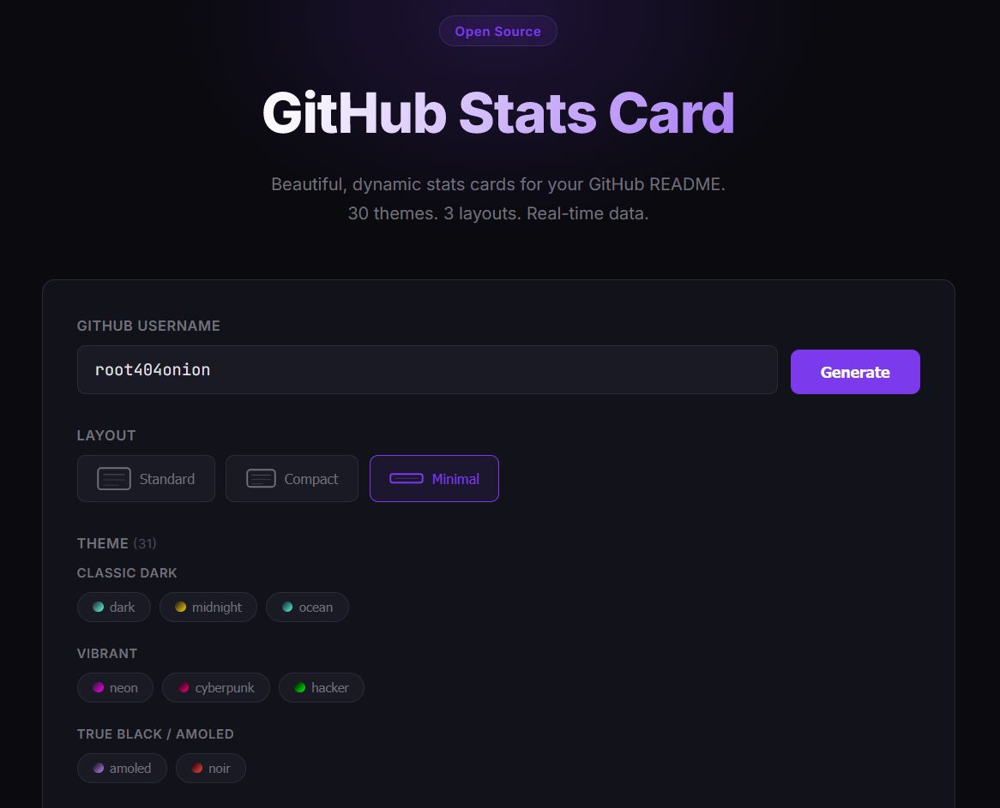
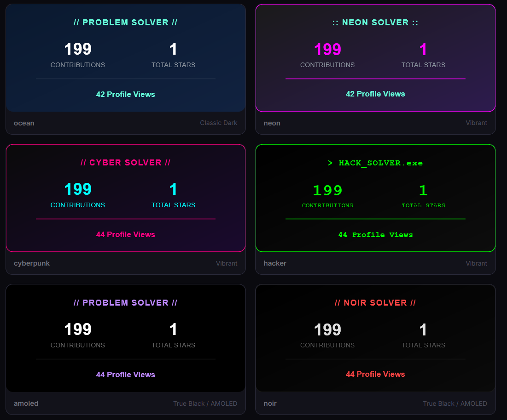
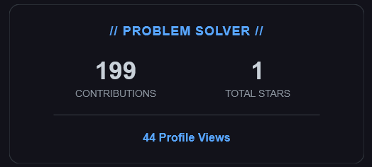
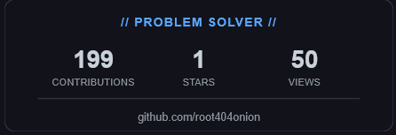
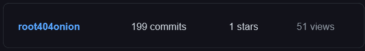

<div align="center">

# ⚡ GitHub Stats Card

**Beautiful, dynamic, and ultra-fast GitHub stats for your README.**

[](https://github-x.web.app)
[](https://github-x.web.app)



*Showcase your GitHub contributions, total repository stars (including organizations!), and track how many people view your profile in real-time.*

</div>

<br>

## ✨ Features

- 🚀 **Lightning Fast**: Powered by Google Cloud Functions (2nd Gen) with instant RTDB caching.
- 🏢 **Organization Support**: Automatically counts stars from all your public organization repositories.
- 🎨 **30+ Premium Themes**: From classic dark modes to vibrant neon, true black, anime styles, and developer IDE themes.
- 📏 **3 Responsive Layouts**: Choose from Standard, Compact, or Minimal depending on your README real estate.
- 👀 **Profile View Tracking**: Built-in accurate visit counter.

---

## 🛠️ How to Use

Generate your card instantly through our web application:
### 👉 **[https://github-x.web.app](https://github-x.web.app)**

1. Enter your GitHub **username**.
2. Select your preferred **layout**.
3. Pick from over 30 beautiful **themes**.
4. Copy the generated Markdown and paste it into your profile README!

<br>

<div align="center">
  
  <br>
  <em>Browse through dozens of responsive, live-preview themes directly on the generator.</em>
</div>

<br>

---

## 📏 Available Layouts

Customize how much space the stats card takes up on your profile.

### Standard Layout
`layout=standard` (Default)
<div align="center">
  
</div>

### Compact Layout
`layout=compact`
<div align="center">
  
</div>

### Minimal Layout
`layout=minimal`
<div align="center">
  
</div>

---

## 💻 Manual API Usage

You can also bypass the web app and build the URL yourself. Just use the following format:
```markdown

```

**Parameters:**
- `YOUR_USERNAME`: Your GitHub handle.
- `THEME_NAME`: Choose from 30+ themes (e.g., `dark`, `tokyonight`, `neon`, `transparent`). *See all themes at `/card/themes`.*
- `layout`: `standard`, `compact`, or `minimal`.

*(Pro Tip: If your image ever gets stuck caching on GitHub, just add `&v=1` to the end of your URL!)*

<br>

<div align="center">

Made with ♥️ by [@root404onion](https://github.com/root404onion) and powered by Firebase.

</div>
